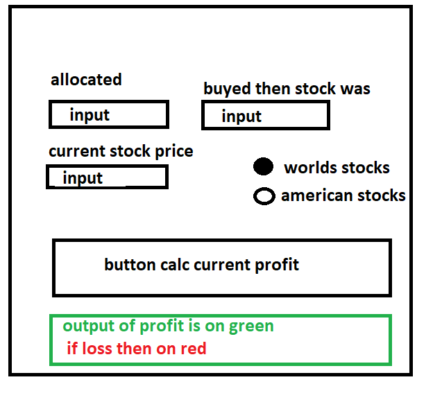

# PGC - Profit-Gui-Count

Made on Python with Tkinter. playing ground.  
App with gui where user inputs data and presses button 
and you have result showing how much it have profit value
from its allocated stock.

# GUI skatch  

